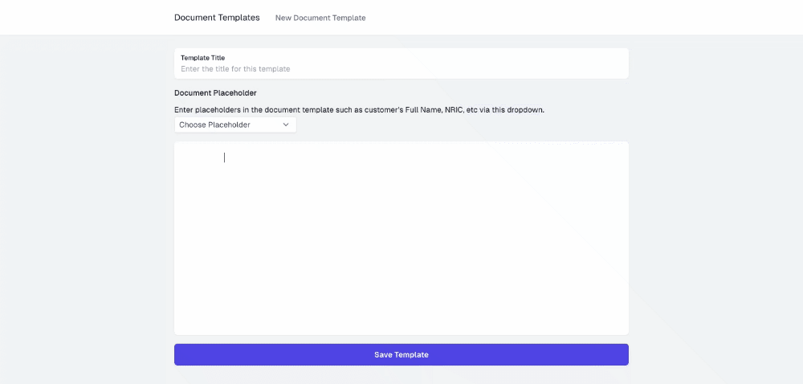

# Installation
- run ```npm install```
- make sure the API app (NestJS) is running
- run ```npm run dev```

# Other Notes
- Demo ni guna [EditorJS](https://editorjs.io/). Sebab apa guna EditorJS;
  - boleh save dalam format JSON. Cuma pastikan datatype untuk column 'content' ialah JSON.
  - UI untuk editor ni clean.
  - ada banyak [plugins](https://github.com/editor-js/awesome-editorjs).
- Boleh download API app (NestJS) di [sini](https://github.com/uzzairatinvoke/pactonline-document-builder-api).
